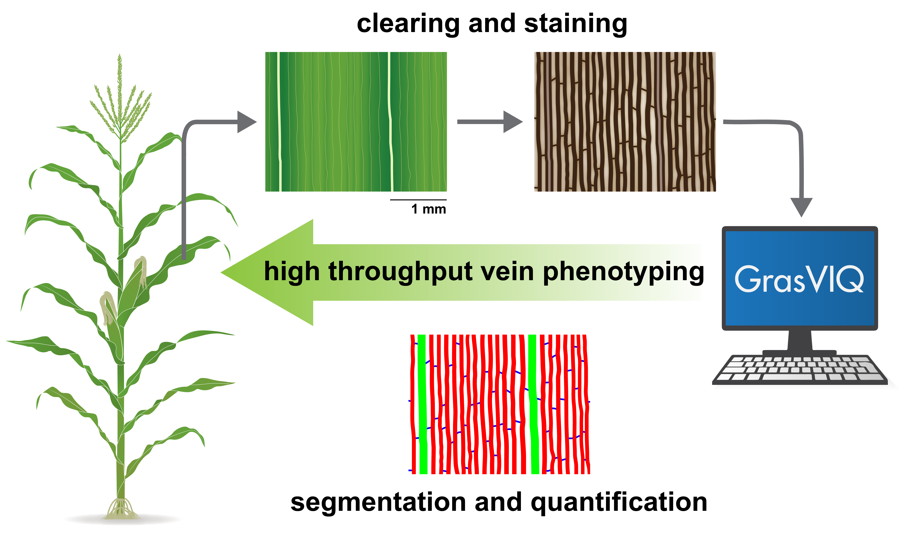

# GrasVIQ  

## Introduction  
Grass Vein Image Quantification (GrasVIQ) is an image analysis framework for automatic quantification of veins in grass leaves. Designed specifically for parallel venation, GrasVIQ automatically segments veins from images of cleared grass leaves using thresholding and edge detection techniques. Veins are quantified and classified into orders, and spatial parameters, such as vein width and interveinal distance, are calculated automatically. For more details, please see    

* Full paper: [GrasVIQ: An Image Analysis Framework for Automatically Quantifying Vein Number and Morphology in Grass Leaves](https://onlinelibrary.wiley.com/doi/abs/10.1111/tpj.15299)

* Authors: Janlo M. Robil, Ke Gao, Claire M. Neighbors, Michael Boeding, Francine M. Carland, Filiz Bunyak, Paula McSteen  

  

## Dependencies  
* MATLAB >= R2016a (Image Processing Toolbox required)

## Grass Vein Image Quantification Demo  
This demo runs GrasVIQ on the sample images in the `data` folder. The batch mode allows GrasVIQ to sequentially process multiple images with the same file extension in the given data directory. 

### Parameters
* `IS_JUVENILE`: flag for juvenile leaf image (set to 1 if processing juvenile leaf images or 0 for adult leaf images) 
* `DEBUG`: flag for visualizing intermediate results for code debugging
* `EXPORT_CSV`: flag for exporting extracted measurements to csv files
* `EXPORT_IMG`: flag for saving segmentation + classification visualization images as png files
* `IMG_FILE_PATH`: path for input images
* `IMG_FILE_TYPE`: file extension for input images (e.g. png, jpg, jpeg)
* `SCALE_FACTOR`: pixels per micrometer (px/um); assume all of the processed images share the same scale

### Run the Demo
Simply run `GrasVIQ.m` in MATLAB.

### Outputs
A folder named `GrasVIQ_Results` will be created in the input data directory. The following output files/folders will be included: 
* `Label` folder: grayscale image showing vein classification results for each input image. 
* `Viz` folder: RGB composite image from the original image and classification result image where vein classes are color-coded: 
  * green (2&deg; veins)
  * red (3&deg; veins)
  * yellow (irregular veins)
  * blue (4&deg; veins)
* `measurements.csv`: measurements including: 
  * ROI (px)
  * ROI (mm)
  * number of long veins (2&deg; + 3&deg;)
  * long vein density (vein/px)
  * long vein density (vein/mm)
  * number of 2&deg; veins
  * number of 3&deg; veins
  * number of 4&deg; veins
  * number of irregular veins
  * mean long vein width (px)
  * mean long vein width (um)
  * mean interveinal distance (px)
  * mean interveinal distance (um)
  * mean 4&deg; vein interval (px)
  * mean 4&deg; vein interval (um)
* `vein_thickness.csv`: thickness (width) for each individual long vein in pixel

## Citation  
If you use this code as part of your work, please cite the following paper:  

`Janlo M. Robil, Ke Gao, Claire M. Neighbors, Michael Boeding, Francine M. Carland, Filiz Bunyak, and Paula McSteen. "GrasVIQ: An Image Analysis Framework for Automatically Quantifying Vein Number and Morphology in Grass Leaves." The Plant Journal (2021).`
